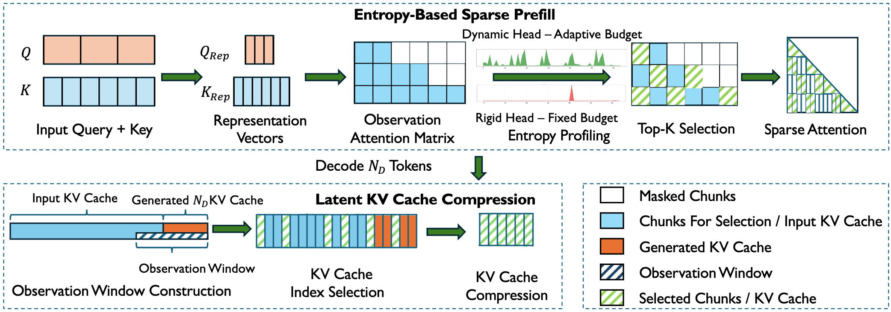

# EntropyInfer




## Environment Preparation

```bash
pip install -r requirements.txt
```

## Conducting Experiments

To conduct experiment on LongBench dataset, run the following script:

```bash
bash experiment/LongBench/evaluate_longbench.sh
python experiment/LongBench/eval.py
```

